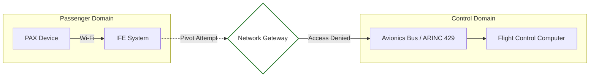
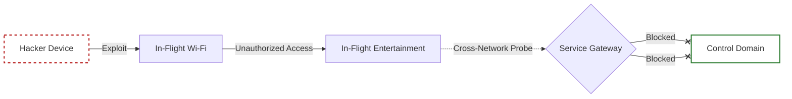
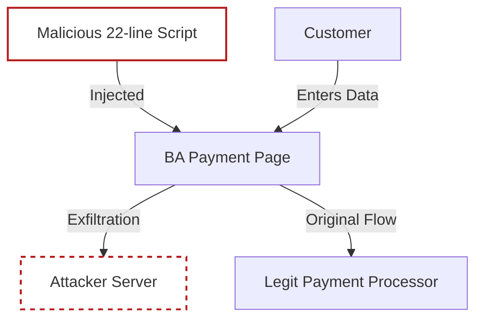

# ✈️ AeroSpace Cybersecurity: Vulnerabilities & Defense
### *A Comprehensive Research Framework for Aviation Asset Protection*

<div align="center">


---

**Analyzing the digital cockpit of the modern world.**  
This repository provides an architected deep-dive into the cybersecurity vulnerabilities of the aviation industry, mapping out strategic defense frameworks to counter evolving threats.

[Introduction](#-introduction) • [Vulnerabilities](#-vulnerabilities) • [Defense](#-defense-techniques) • [STRIDE](#-stride-model) • [Cases](#-case-studies) • [Code](#-practical-implementation)

</div>

---

This repository provides an in-depth analysis of cybersecurity vulnerabilities specific to the aviation industry, along with strategic defense techniques designed to counter these threats. The research explores various potential cyber threats faced by aviation systems, such as Distributed Denial of Service (DDoS) attacks, GPS spoofing, and in-flight entertainment (IFE) vulnerabilities. Additionally, it offers defense frameworks, practical recommendations, and emerging technologies for protecting critical aviation infrastructure.

---

## Executive Summary

This document serves as a comprehensive resource that highlights the unique cybersecurity challenges faced by the aviation industry and the measures necessary to mitigate these risks. It synthesizes research findings and best practices, aiming to enhance the overall security posture of aviation systems.

---

## Table of Contents

1. [Introduction](#introduction)
2. [Understanding Aviation Systems](#understanding-aviation-systems)
3. [High-Level Design (HLD) of Aviation Architecture](#high-level-design-hld-of-aviation-architecture)
4. [Vulnerabilities in Aviation Systems](#vulnerabilities-in-aviation-systems)
5. [Key Cybersecurity Incidents in Aviation](#key-cybersecurity-incidents-in-aviation)
6. [Defense Techniques](#defense-techniques)
7. [Detailed Use Cases](#detailed-use-cases)
8. [STRIDE Threat Classification](#stride-threat-classification)
9. [Risk Assessment Framework](#risk-assessment-framework)
10. [Emerging Technologies in Aviation Cybersecurity](#emerging-technologies-in-aviation-cybersecurity)
11. [Aviation Ecosystem Landscape](#aviation-ecosystem-landscape)
12. [Visual Attack Flows](#visual-attack-flows)
13. [Best Practices](#best-practices)
14. [Conclusion](#conclusion)
15. [References](#references)
16. [Contact Information for Collaboration](#contact-information-for-collaboration)
17. [Feedback Section](#feedback-section)
18. [Appendices](#appendices)

---

## Introduction

Aviation is a cornerstone of global transportation and economic connectivity. However, as the industry increasingly relies on interconnected digital systems, it becomes more vulnerable to cyber threats that can impact passenger safety, data integrity, and operational continuity. Cybersecurity in aviation is therefore critical, involving the protection of sensitive data, navigation systems, and communication channels. This research aims to identify vulnerabilities within aviation systems and propose robust defense strategies to safeguard this vital industry from the evolving landscape of cyber threats.

---

## Understanding Aviation Systems

The modern aircraft is no longer just a mechanical machine; it is a complex, flying data center. To ensure safety and security, the system is architected into three primary **Logical Domains**. Understanding these domains is crucial for identifying where vulnerabilities lie and how critical systems are protected.

### 1. 🚀 Aircraft Control Domain (ACD)
The ACD is the most critical layer. It encompasses all systems required to keep the aircraft in the air and safely navigate it to its destination. 

*   **Primary Components**:
    *   **Flight Management System (FMS)**: The "Autopilot brain" that follows the programmed flight path.
    *   **ADIRU (Air Data/Inertial Reference Unit)**: Provides position, altitude, and speed data.
    *   **FADEC**: Electronic controllers for engine performance.
*   **Vulnerability Profile**: Attacks here are rare due to extreme isolation but catastrophic if successful. Risks include **Sensor Spoofing** (tricking GPS/Pitot tubes) and **Avionics Bus Hijacking** (ARINC 429).
*   **Criticality**: 🔴 **Maximum (Safety-Critical)** 

---

### 2. 📋 Airline Information Services Domain (AISD)
This domain bridges the gap between the cockpit and the airline's ground operations. it handles administrative data and real-time operational telemetry.

*   **Primary Components**:
    *   **EFB (Electronic Flight Bag)**: Tablets used by pilots for charts, weather, and weight-and-balance calculations.
    *   **ACARS/SatCom**: Digital data links used to send "text-based" status updates to the ground.
*   **Vulnerability Profile**: The AISD is often the "soft entry point." Vulnerabilities include **Supply-Chain Attacks** (compromised flight charts) and **Intercepting Unencrypted Telemetry**.
*   **Criticality**: 🟡 **High (Operational-Critical)**

---

### 3. 🎮 Passenger Information & Entertainment Domain (PIED)
The PIED is designed for passenger comfort. Currently, this is the most connected domain because it interfaces with the public internet.

*   **Primary Components**:
    *   **IFE (In-Flight Entertainment)**: The screens and media servers at every seat.
    *   **Cabin Wi-Fi**: The onboard network providing internet access to passenger devices.
*   **Vulnerability Profile**: The primary risk is **Cross-Domain Pivoting**. While "Air-Gaps" exist, attackers explore theoretical paths from the IFE system to the AISD through shared network hardware (Gateways).
*   **Criticality**: 🟢 **Low (Service-Critical)**

### 🏁 How the System Works (Summary)
Digital data flows from the **Global Environment** (Satellites/ATC) into the **ACD** for navigation. Simultaneously, the **AISD** syncs flight logs with the airline's home base. Most importantly, a **Security Gateway** (Data Diode) sits between these domains to ensure that a compromised movie screen in the **PIED** cannot send a command to the engines in the **ACD**.

## High-Level Design (HLD): Hyper-Detailed Aviation System Architecture

This "God-Level" HLD maps the total complexity of a modern connected aircraft. It illustrates the symbiotic relationship between Integrated Modular Avionics (IMA), multi-path global communications, and the multi-layered cabin and entertainment infrastructure.

```mermaid
flowchart TD
    %% --- EXTERNAL GLOBAL INFRASTRUCTURE ---
    subgraph Global_Networks ["🌐 Global Aerospace Infrastructure"]
        subgraph GNSS ["🛰️ Navigation Clusters"]
            GPS["GPS (USA)"]
            GLONASS["GLONASS (Russia)"]
            GALILEO["Galileo (EU)"]
            SBAS["SBAS/WAAS (Augmentation)"]
        end
        
        subgraph Terrestrial ["📡 Ground & ATC Services"]
            ATC_VHF["ATC Voice (VHF/HF)"]
            DATIS["D-ATIS (Digital Airport Info)"]
            VOLMET["VOLMET (Weather)"]
            ACARS_HOST["SITA/ARINC ACARS Host"]
            MAINT_GW["Maintenance Gatelink (Wi-Fi/4G)"]
        end
        
        subgraph Space_Comms ["🌌 Satellite Networks"]
            INMARSAT["Inmarsat (L-Band/SwiftBroadband)"]
            IRIDIUM["Iridium (Certus/L-Band)"]
            KU_KA["Ku/Ka-Band (Global Connectivity)"]
        end
    end

    %% --- AIRCRAFT EXTERNAL TELEMETRY INTERFACES ---
    subgraph External_Comms ["📡 Communication Front-End (LRUs)"]
        RMU["Radio Management Unit (RMU)"]
        SDU["Satellite Data Unit (SDU)"]
        ADSB_OUT["ADS-B Out Transponder"]
        ADSB_IN["ADS-B In Receiver"]
        VDR_1["VHF Data Radio (VDR 1)"]
        VDR_2["VHF Data Radio (VDR 2)"]
    end

    %% --- AIRCRAFT CONTROL DOMAIN (THE BRAIN) ---
    subgraph ACD ["🚀 Aircraft Control Domain (ACD) - Safety Level A"]
        direction TB

        subgraph Sensors_Probes ["🧪 Advanced Sensor Suite"]
            ADIRU_A["ADIRU A (Primary)"]
            ADIRU_B["ADIRU B (Hot-Standby)"]
            ADIRU_C["ADIRU C (Voting)"]
            RAD_ALT["Radar Altimeter (LRRA)"]
            WX_RADAR["Weather Radar (WXR)"]
            ICE_DET["Ice Detection Sensor"]
        end

        subgraph IMA_Core ["🌋 Integrated Modular Avionics (IMA)"]
            CPIOM_A["CPIOM A (Flight Controls)"]
            CPIOM_B["CPIOM B (Apu/Fuel)"]
            CPIOM_C["CPIOM C (Landing Gear)"]
            FMS_MNG["FMS Manager (Dual-Stack)"]
            MCDU_P["MCDU (Pilot Terminal)"]
            MCDU_C["MCDU (Co-Pilot Terminal)"]
        end

        subgraph Safety_Systems ["🛡️ Critical Safety Systems"]
            TCAS["TCAS (Collision Avoidance)"]
            GPWS["E-GPWS (Proximity Warning)"]
            FWC["Flight Warning Computer (FWC)"]
        end

        subgraph Data_Backbone ["📟 Avionics Data Bus Spine"]
            ARINC_429{{"ARINC 429 Low-Speed Bus"}}
            AFDX_SW_1{{"AFDX Switch A (A664)"}}
            AFDX_SW_2{{"AFDX Switch B (A664)"}}
            CAN_BUS{{"CAN Bus (Engine/Utility)"}}
        end

        subgraph Cockpit_Displays ["🕶️ Human-Machine Interface (HMI)"]
            PFD_L["Left PFD (Primary)"]
            PFD_R["Right PFD (Primary)"]
            ND_L["Left Nav Display"]
            ND_R["Right Nav Display"]
            ECAM_U["Upper ECAM (Engine)"]
            ECAM_L["Lower ECAM (System/SD)"]
        end

        subgraph Control_Execution ["⚙️ Mechanical Control"]
            FADEC_1["FADEC Engine 1"]
            FADEC_2["FADEC Engine 2"]
            ACTUATOR["Flight Surface Actuators"]
        end
    end

    %% --- THE DEFENSE PERIMETER ---
    subgraph Perimeter ["🛡️ Aircraft Security Perimeter"]
        DIODE_1{{"🔐 ARINC 811 Data Diode"}}
        FW_GW{{"🔥 Secure Cabin/Cockpit Gateway"}}
        ADCN_NET{{"🌐 ADCN Managed Network"}}
    end

    %% --- AIRLINE INFORMATION DOMAIN ---
    subgraph AISD ["📋 Airline Services Domain (AISD)"]
        EFB_TAB["EFB Pilot Tablet"]
        OITS_SRV["Onboard Info Server"]
        QAR_REC["Quick Access Recorder"]
        MAINT_PORT["Maintenance Access Port"]
        CIDS_DIR["CIDS (Cabin Intercom)"]
    end

    %% --- PASSENGER & CABIN DOMAIN ---
    subgraph PIED ["🎮 Passenger Domain (PIED)"]
        subgraph IFE_Core ["📺 IFE Architecture"]
            HEE["Head-End Equipment (Server)"]
            ADB["Area Distribution Box"]
            SEB["Seat Electronic Box (Node)"]
            SMART_SCR["In-Seat Smart Screen"]
        end
        
        subgraph Connectivity_Cabin ["📶 Cabin Network"]
            WAP_1["Cabin WAP (Interior)"]
            GSM_OB["Onboard GSM/Cellular"]
            PAX_LAN["Passenger LAN/Entertainment"]
        end
    end

    %% --- LOGIC FLOWS & DATA BRIDGES ---
    %% External to Aircraft
    GNSS -->|LF/RF| Sensors_Probes
    Terrestrial <-->|VHF/HF| External_Comms
    Space_Comms <-->|S/Ku/Ka| External_Comms

    %% Hardware Interfacing
    External_Comms <-->|Serial/IP| IMA_Core
    External_Comms -->|High Speed| Perimeter

    %% ACD Deep Integration
    Sensors_Probes --> ARINC_429
    Safety_Systems <--> ARINC_429
    ARINC_429 <--> IMA_Core
    IMA_Core <--> AFDX_SW_1
    AFDX_SW_1 <--> AFDX_SW_2
    AFDX_SW_2 --> Cockpit_Displays
    
    IMA_Core --> CAN_BUS
    CAN_BUS --> Control_Execution
    
    %% Cross-Domain Flow (Security Controlled)
    IMA_Core -.->|Oneway UDP| DIODE_1
    DIODE_1 --> ADCN_NET
    FW_GW <--> ADCN_NET
    ADCN_NET --> AISD
    ADCN_NET <--> PIED

    %% AISD Internal Routing
    AISD --> EFB_TAB
    AISD --> QAR_REC
    AISD --> CIDS_DIR
    MAINT_PORT --> AISD

    %% PIED Detailed Flow
    HEE --> ADB
    ADB --> SEB
    SEB --> SMART_SCR
    WAP_1 --> HEE
    GSM_OB --> WAVE_SRV
    PAX_LAN --> HEE

    %% --- VISUAL STYLING (Professional Blueprint) ---
    classDef space stroke:#E65100,stroke-width:2px,fill:none,stroke-dasharray: 5 5;
    classDef ground stroke:#33691E,stroke-width:2px,fill:none;
    classDef sensor stroke:#1565C0,stroke-width:2px,fill:none;
    classDef main stroke:#B71C1C,stroke-width:3px,fill:none;
    classDef network stroke:#1A237E,stroke-width:2px,fill:none,stroke-dasharray: 2 2;
    classDef cabinet stroke:#4A148C,stroke-width:1.5px,fill:none;

    class GPS,GLONASS,GALILEO,SBAS,INMARSAT,IRIDIUM,KU_KA space;
    class ATC_VHF,DATIS,VOLMET,ACARS_HOST,MAINT_GW ground;
    class ADIRU_A,ADIRU_B,ADIRU_C,RAD_ALT,WX_RADAR,ICE_DET sensor;
    class IMA_Core,CPIOM_A,CPIOM_B,CPIOM_C,FMS_MNG,FADEC_1,FADEC_2 main;
    class DIODE_1,FW_GW,ADCN_NET network;
    class HEE,ADB,SEB,SMART_SCR cabinet;
```



### Component Breakdown: The Digital Nervous System

To understand the attack surface, we must first break down the functional role of each major segment in the architecture:

#### 1. 🌐 Global Infrastructure (External Segment)
- **GNSS Clusters**: Provides high-precision PNT (Position, Navigation, and Timing) data from GPS, GLONASS, and Galileo. This is the primary target for **GPS Spoofing**.
- **Terrestrial ATC**: Ground-based radar and voice/data links including **D-ATIS** and **VOLMET**. Includes **ACARS** for administrative messaging between the aircraft and the AOC.
- **Space Comms**: High-bandwidth satellite networks (Inmarsat, Iridium, Ku/Ka-Band) for global internet and cockpit data links.

#### 2. 🚀 Aircraft Control Domain (ACD) - The Brain
- **IMA Core (Integrated Modular Avionics)**: The centralized computing platform where shard processing modules (**CPIOMs**) host critical applications for flight control, fuel management, and landing gear.
- **FMS Manager**: The redundant brain that calculates flight paths, optimizes performance, and manages the navigation database.
- **Advanced Sensors**: A redundant suite including **ADIRUs** (Air Data/Inertial Reference), Radar Altimeters, and specialized Ice Detection probes.
- **Safety Systems**: 
    - **TCAS**: Prevents mid-air collisions via transponder interrogation.
    - **GPWS**: Prevents terrain-related accidents (CFIT).
- **Data Backbone**: 
    - **AFDX (ARINC 664)**: High-speed, deterministic Ethernet for mission-critical data.
    - **ARINC 429**: The legacy serial backbone for point-to-point avionics communication.
    - **CAN Bus**: Utility bus for engine and subsystem health monitoring.

#### 3. 🛡️ Security Perimeter & Routing
- **Data Diode (ARINC 811)**: A hardware-enforced one-way gate that allows safety data to flow *out* to the cabin (for moving maps, etc.) but strictly prevents any external data from entering the **ACD**.
- **Secure Gateway**: A firewall-managed bridge between the cockpit and cabin networks.

#### 4. 📋 Airline Information (AISD) & Passenger (PIED) Domains
- **EFB (Electronic Flight Bag)**: The pilot's operational tablet. A critical interface for flight plans and charts, often targeted via supply-chain or update attacks.
- **IFE Core (In-Flight Entertainment)**: The media server architecture (HEE, ADB, SEB) that delivers content to passenger seats. Investigations often focus on this as a potential (though highly isolated) entry point.
- **Cabin Connectivity**: WAPs and Onboard GSM services providing passenger internet access.

---

## Vulnerabilities in Aviation Systems

The table below outlines common cybersecurity vulnerabilities in aviation, their impacts, and real-world examples where possible.

| Vulnerability                       | Description                                                                                       | Potential Impact                         | Example or Case Study                       |
|-------------------------------------|---------------------------------------------------------------------------------------------------|------------------------------------------|---------------------------------------------|
| **DDoS Attacks**                    | Overloads systems with traffic to disrupt service.                                               | System downtime, financial losses        | LOT Polish Airlines DDoS attack (2015)      |
| **GPS Spoofing**                    | Injects false GPS data to mislead aircraft navigation.                                           | Navigation errors, flight delays         | Black Hat demonstration on ADS-B spoofing   |
| **Air Traffic Control (ATC) Hacks** | Unauthorized access to ATC communications.                                                       | Threat to safe aircraft coordination     | British ATC hack (2011)                     |
| **In-Flight Entertainment (IFE) System Hacks** | Exploits vulnerabilities in entertainment systems, potentially affecting other aircraft systems. | Access to critical systems               | Wi-Fi vulnerabilities allowing cross-network access |
| **VHF Communication Jamming**       | Disrupts VHF channels, delaying or blocking communication between pilots and ATC.               | Reduced safety, delayed responses        | Reported spoofing incidents in aviation     |
| **Satellite Communication Interference** | Targets satellite links for navigation and communication.                                   | Navigation disruption, loss of data      | Unmanned aerial vehicle (UAV) spoofing      |

---

## Key Cybersecurity Incidents in Aviation

The following table summarizes notable cybersecurity incidents in aviation, illustrating the real-world impact of these vulnerabilities.

| Incident                        | Year | Type of Attack                | Description                                                                                  | Impact                                |
|---------------------------------|------|-------------------------------|----------------------------------------------------------------------------------------------|---------------------------------------|
| LOT Polish Airlines DDoS Attack | 2015 | DDoS                          | DDoS attack disrupted flight plans, grounding multiple flights for hours.                   | Financial loss, passenger disruption  |
| GPS Spoofing Demonstration      | 2015 | GPS Spoofing                  | Black Hat researchers demonstrated GPS spoofing capabilities on ADS-B systems.               | Highlighted navigation risks          |
| British ATC Hack                | 2011 | Unauthorized Access           | Attackers compromised ATC radio frequencies to interfere with communications.               | Raised safety concerns                |
| UAV Spoofing Incident           | 2018 | GPS Spoofing                  | GPS spoofing used to redirect an unmanned aerial vehicle’s path.                             | Security and operational implications |
| In-Flight Wi-Fi Hack            | 2015 | In-Flight System Exploit      | Security researcher gained access to IFE system and potentially critical aircraft controls.  | Exposed IFE security flaws            |

---

## Defense Techniques

The table below lists key defense techniques and strategies used to protect aviation systems, along with relevant tools and standards for each.

| Defense Technique                | Description                                                                                      | Tools/Standards                     | Implementation Level   |
|----------------------------------|--------------------------------------------------------------------------------------------------|-------------------------------------|-------------------------|
| **Application Security**         | Protects applications through encryption, input validation, and web filtering.                   | Firewalls, Web Application Firewalls (WAFs) | Application layer     |
| **Information Security**         | Ensures confidentiality, integrity, and availability of sensitive data.                         | ISO27001, Data Encryption          | Data protection        |
| **Endpoint Security**            | Protects endpoint devices from threats through antivirus, EDR, and monitoring.                  | Antivirus, Endpoint Detection and Response (EDR) | Device layer         |
| **Network Security**             | Secures networks using intrusion detection, firewalls, and virtual private networks (VPNs).     | VPN, IDS, Firewalls, DLP           | Network layer          |
| **Incident Response Planning**   | Establishes protocols for detecting, containing, and recovering from cyber incidents.           | NIST, SANS Frameworks               | Organizational level    |
| **Access Control Management**    | Limits access to critical systems using multi-factor authentication and role-based access control. | MFA, RBAC                          | Access management      |
| **Training and Awareness**       | Regular cybersecurity training for employees to recognize and respond to threats.               | Awareness Programs, Phishing Simulations | Human element       |

### Detailed Use Cases

Below are examples of how defense techniques have been effectively implemented in the aviation industry:

- **Application Security**: Implementation of Web Application Firewalls (WAFs) in airline booking systems has significantly reduced the risk of SQL injection attacks.
- **Incident Response Planning**: Major airlines have established dedicated cybersecurity incident response teams to quickly address threats and vulnerabilities as they arise.

### 🛡️ Defense-in-Depth Architecture
A multi-layered security approach is essential in aviation to ensure that if one control fails, others remain to protect the Aircraft Control Domain (ACD).

```mermaid
graph BT
    subgraph L5 ["Layer 5: 🧘 Human & Policy"]
        P1[Security Training]
        P2[Vetting & Clearances]
        P3[Regular Audits]
    end
    subgraph L4 ["Layer 4: 💾 Data & Encryption"]
        D1[AES-256 Encryption]
        D2[Hardware Security Modules]
        D3[PKI Infrastructure]
    end
    subgraph L3 ["Layer 3: 💻 Host & Endpoint"]
        H1[EDR / Antivirus]
        H2[OS Hardening]
        H3[Patch Management]
    end
    subgraph L2 ["Layer 2: 🌐 Network & App"]
        N1[IDS / IPS]
        N2[Micro-segmentation]
        N3[WAF / API Security]
    end
    subgraph L1 ["Layer 1: 🛡️ Perimeter"]
        F1[Firewalls]
        F2[Data Diodes / Air-gaps]
        F3[VPN / Encryption]
    end
    
    L1 --> L2
    L2 --> L3
    L3 --> L4
    L4 --> L5
    
    %% Professional styling - No background colors
    style L1 fill:none,stroke:#333,stroke-width:2px,stroke-dasharray: 2 2
    style L2 fill:none,stroke:#333,stroke-width:2px
    style L3 fill:none,stroke:#333,stroke-width:2px
    style L4 fill:none,stroke:#333,stroke-width:2px
    style L5 fill:none,stroke:#333,stroke-width:2px,stroke-dasharray: 5 5
```



---

## STRIDE Threat Classification

The STRIDE model is widely used in cybersecurity to classify and analyze different types of threats. Below is a summary of how each STRIDE category applies to aviation cybersecurity, with examples and suggested countermeasures.

| Threat Type             | Effect                               | Example                          | Countermeasure                          |
|-------------------------|--------------------------------------|----------------------------------|-----------------------------------------|
| **Spoofing**            | Compromises authentication           | GPS spoofing affecting navigation | Strong authentication and encryption   |
| **Tampering**           | Affects data integrity               | ADS-B data manipulation          | Data integrity verification             |
| **Repudiation**         | Denies action validation             | In-flight entertainment (IFE) access logs | Comprehensive logging and monitoring |
| **Information Disclosure** | Breaches confidentiality         | ATC communication interception   | Use of encryption protocols             |
| **Denial of Service**   | Disrupts service availability        | DDoS attack on airline systems   | Load balancing, firewalls               |
| **Elevation of Privilege** | Gains unauthorized access        | Unauthorized access to VHF radios | Access control and auditing             |

---

## Risk Assessment Framework

A structured approach to assess risks associated with cybersecurity vulnerabilities in the aviation industry involves:

1. **Risk Identification**: Identify potential risks and vulnerabilities in aviation systems.
2. **Risk Analysis**: Evaluate the likelihood and impact of identified risks.
3. **Risk Evaluation**: Determine the significance of the risks and prioritize them for treatment.
4. **Risk Treatment**: Develop strategies to mitigate identified risks, including implementing controls and policies.

---

## Emerging Technologies in Aviation Cybersecurity

Aviation cybersecurity is evolving, and new technologies are being developed to enhance protection. Here are some of the emerging technologies:

| Technology                     | Description                                                              | Application in Aviation              |
|--------------------------------|--------------------------------------------------------------------------|--------------------------------------|
| **Quantum Encryption**         | Uses quantum mechanics to secure communication, making it nearly unbreakable. | Secures satellite and ground communications |
| **AI-based Threat Detection**   | Employs artificial intelligence to identify patterns of potential threats. | Real-time threat detection in ATC    |
| **Blockchain**                 | Ensures secure data transactions by using decentralized ledgers.         | Secure flight data logging           |
| **5G Network Security**        | Enhances speed and security for critical data transmission.             | Reliable and secure in-flight Wi-Fi  |
| **IoT Security Frameworks**    | Protects interconnected devices within aircraft and airports.           | Protects in-flight entertainment and connected aircraft systems |

---

## Regulatory and Compliance Standards

Compliance with industry standards and regulations is critical to ensuring cybersecurity in aviation. Key regulations include:

- **FAA Regulations**: Guidelines for aviation safety and cybersecurity standards.
- **NIST Cybersecurity Framework**: Provides a policy framework of computer security guidance.
- **ISO 27001**: International standard for information security management.

---

---

## Aviation Ecosystem Landscape

The aviation ecosystem is a massive, interconnected network involving space, ground, and airborne segments. Understanding this landscape is critical for identifying potential entry points for attackers.

```mermaid
graph TD
    subgraph Space ["🛰️ Space Segment"]
        GPS[GNSS / GPS Satellites]
        SatCom[Satellite Communication]
    end

    subgraph Ground ["🏢 Ground Segment"]
        ATC[Air Traffic Control Center]
        AirlineOps[Airline Operations Center]
        GroundSupport[Maintenance & Ground Support]
        Telecon[Telecommunication Networks]
    end

    subgraph Aircraft ["✈️ Aircraft Segment"]
        subgraph ACD ["Aircraft Control Domain"]
            FMS[Flight Management System]
            FCC[Flight Control Computer]
            ADSB[ADS-B Transceiver]
        end
        subgraph AISD ["Int. Service Domain"]
            EFB[Electronic Flight Bag]
            MaintNodes[Maintenance Nodes]
        end
        subgraph PIED ["Passenger Domain"]
            IFE[In-Flight Entertainment]
            Wi-Fi[In-Flight Wi-Fi]
        end
    end

    GPS -->|L1/L2 Signals| ADSB
    SatCom -->|Data Link| ACD
    ATC -->|CPDLC / VHF| ACD
    AirlineOps -->|ACARS| ACD
    GroundSupport -->|Physical / Wi-Fi| AISD
    AISD --- ACD
    PIED -.->|Gateway / Diode| ACD
    Telecon --> SatCom
    Telecon --> ATC
    
    %% Professional styling - No background colors
    style Aircraft fill:none,stroke:#01579b,stroke-width:2px
    style Ground fill:none,stroke:#33691e,stroke-width:2px
    style Space fill:none,stroke:#e65100,stroke-width:2px,stroke-dasharray: 5 5
```



---

## Visual Attack Flows

To better understand the mechanics of aviation cyber-attacks, we use flow diagrams to visualize the path of an exploit.

### 1. GPS Spoofing "Power Overtake" Flow
This diagram illustrates how an attacker uses a high-power Signal Generator (SDR) to force an aircraft receiver to lock onto malicious PNT data.

```mermaid
graph TD
    A["🛰️ GNSS Satellites"] -->|Low Power L1/L2 Signals| B("✈️ Aircraft Receiver")
    C["📡 Attacker (SDR/HackRF)"] -->|High Power Spoofed Signals| B
    B --> D{Signal Comparison}
    D -->|Higher SNR Wins| E[Receiver Locks to Spoofed Signal]
    E --> F[Injecting False Lat/Long/Time]
    F --> G[Navigation Deviation / FMS Error]
    
    F --> G[Navigation Deviation / FMS Error]
    
    %% Professional styling
    style C stroke:#B71C1C,stroke-width:2px,fill:none,stroke-dasharray: 5 5
    style G stroke:#B71C1C,stroke-width:3px,fill:none
```



### 2. Theoretical IFE-to-ACD Pivot
Visualizing the bridge between the **Passenger Information and Entertainment Domain (PIED)** and the **Aircraft Control Domain (ACD)**.



---

## Case Studies

Several case studies illustrate the application of cybersecurity strategies in aviation:

### 1. LOT Polish Airlines DDoS Attack (2015)

**Overview**: In 2015, LOT Polish Airlines experienced a significant DDoS attack that led to the grounding of flights for several hours.

| **Key Details**                  | **Description**                                                       |
|----------------------------------|-----------------------------------------------------------------------|
| **Attack Type**                  | Distributed Denial of Service (DDoS)                                 |
| **Date**                         | November 2015                                                        |
| **Impact**                       | Flight delays, cancellations, financial losses                       |
| **Duration of Disruption**       | Several hours                                                        |
| **Response Strategy**            | Engaged cybersecurity experts to mitigate the attack                 |
| **Actions Taken**                | Improved network security, implemented DDoS mitigation tools         |
| **Future Implementations**       | Regular security audits and DDoS attack simulation exercises         |
| **Lessons Learned**              | Importance of a robust incident response plan and regular testing    |

**Attack Chain Visualization:**


---

---

### 2. United Airlines In-flight Wi-Fi Breach (2015)

**Overview**: United Airlines faced a breach where vulnerabilities in their in-flight Wi-Fi system were exploited by hackers.

| **Key Details**                  | **Description**                                                       |
|----------------------------------|-----------------------------------------------------------------------|
| **Attack Type**                  | In-flight Wi-Fi system breach                                        |
| **Date**                         | 2015                                                                  |
| **Impact**                       | Unauthorized access to passenger data and aircraft systems          |
| **Vulnerabilities Exploited**    | Insecure Wi-Fi protocols                                             |
| **Response Measures**            | Enhanced security protocols for in-flight systems                   |
| **Actions Taken**                | Conducted vulnerability assessments and penetration testing         |
| **Future Implementations**       | Adoption of stronger encryption protocols for in-flight Wi-Fi       |

**Theoretical Pivot Path:**


---

---

### 3. British Airways Data Breach (2018)

**Overview**: British Airways suffered a significant data breach affecting hundreds of thousands of customers due to compromised payment details.

| **Key Details**                  | **Description**                                                       |
|----------------------------------|-----------------------------------------------------------------------|
| **Attack Type**                  | Data breach                                                         |
| **Date**                         | September 2018                                                      |
| **Impact**                       | Financial data exposure of 500,000 customers                       |
| **Regulatory Action**            | Fines imposed by the UK Information Commissioner’s Office          |
| **Response Measures**            | Improved security infrastructure and customer notification          |
| **Actions Taken**                | Conducted a thorough investigation and upgraded payment security    |
| **Future Implementations**       | Implemented multi-factor authentication for online transactions     |

**Malware Flow (Magecart):**


---

---

### 4. Cathay Pacific Data Breach (2018)

**Overview**: Cathay Pacific experienced a data breach that compromised personal data of 9.4 million passengers.

| **Key Details**                  | **Description**                                                       |
|----------------------------------|-----------------------------------------------------------------------|
| **Attack Type**                  | Data breach                                                         |
| **Date**                         | October 2018                                                       |
| **Impact**                       | Compromised personal data of 9.4 million passengers                 |
| **Vulnerabilities Exploited**    | Weak security measures                                               |
| **Response Measures**            | Enhanced data encryption and monitoring                              |
| **Actions Taken**                | Conducted an extensive audit of security protocols                   |
| **Future Implementations**       | Investment in advanced threat detection systems                      |

---

### 5. Marriott International Data Breach (2018)

**Overview**: Marriott revealed a data breach affecting approximately 500 million guests, including sensitive personal information.

| **Key Details**                  | **Description**                                                       |
|----------------------------------|-----------------------------------------------------------------------|
| **Attack Type**                  | Data breach                                                         |
| **Date**                         | November 2018                                                       |
| **Impact**                       | Personal data of 500 million guests compromised                     |
| **Vulnerabilities Exploited**    | Inadequate security practices and lack of encryption                 |
| **Response Measures**            | Immediate investigation and public disclosure                        |
| **Actions Taken**                | Enhanced security systems and user notification                      |
| **Future Implementations**       | Implementation of comprehensive data protection policies             |

---

### 6. Singapore Airlines Cyber Attack (2018)

**Overview**: Singapore Airlines faced a cyber attack that targeted its customers' personal data, although no financial information was compromised.

| **Key Details**                  | **Description**                                                       |
|----------------------------------|-----------------------------------------------------------------------|
| **Attack Type**                  | Data breach                                                         |
| **Date**                         | May 2018                                                           |
| **Impact**                       | Access to passenger data of 285,000 customers                      |
| **Response Measures**            | Investigation by cybersecurity firms                                 |
| **Actions Taken**                | Strengthened data security and customer communication                |
| **Future Implementations**       | Regular security assessments and enhanced data encryption            |

---

### 7. Air Canada Data Breach (2020)

**Overview**: Air Canada reported a data breach affecting the personal data of approximately 20,000 customers due to a vulnerability in its mobile app.

| **Key Details**                  | **Description**                                                       |
|----------------------------------|-----------------------------------------------------------------------|
| **Attack Type**                  | Data breach                                                         |
| **Date**                         | May 2020                                                           |
| **Impact**                       | Personal data exposure of about 20,000 customers                   |
| **Vulnerabilities Exploited**    | Weakness in mobile app security                                     |
| **Response Measures**            | Investigation and remediation                                        |
| **Actions Taken**                | Security updates and customer notifications                         |
| **Future Implementations**       | Enhanced security measures for mobile applications                   |

---

### 8. EasyJet Data Breach (2020)

**Overview**: EasyJet disclosed a data breach affecting approximately 9 million customers, with email addresses and travel details compromised.

| **Key Details**                  | **Description**                                                       |
|----------------------------------|-----------------------------------------------------------------------|
| **Attack Type**                  | Data breach                                                         |
| **Date**                         | May 2020                                                           |
| **Impact**                       | Compromised email addresses and travel details of 9 million customers |
| **Response Measures**            | Prompt customer notification                                         |
| **Actions Taken**                | Investigation into the breach and improved cybersecurity protocols   |
| **Future Implementations**       | Strengthened security measures and risk assessments                  |

---

### 9. TUI Group Data Breach (2020)

**Overview**: TUI Group experienced a significant cyber incident that resulted in unauthorized access to customer information.

| **Key Details**                  | **Description**                                                       |
|----------------------------------|-----------------------------------------------------------------------|
| **Attack Type**                  | Data breach                                                         |
| **Date**                         | June 2020                                                          |
| **Impact**                       | Unauthorized access to personal data                                |
| **Response Measures**            | Full investigation initiated                                         |
| **Actions Taken**                | Implementation of additional security measures                       |
| **Future Implementations**       | Regular security reviews and audits                                  |

---

### 10. Lufthansa Cyber Attack (2020)

**Overview**: Lufthansa faced a cyber attack that targeted customer data, leading to enhanced security measures.

| **Key Details**                  | **Description**                                                       |
|----------------------------------|-----------------------------------------------------------------------|
| **Attack Type**                  | Data breach                                                         |
| **Date**                         | July 2020                                                          |
| **Impact**                       | Compromised customer data                                            |
| **Response Measures**            | Immediate containment and response                                   |
| **Actions Taken**                | Enhanced cybersecurity infrastructure                                |
| **Future Implementations**       | Regular staff training and security awareness programs                |

---

## Future Trends and Predictions

The future of aviation cybersecurity will likely involve several transformative trends aimed at enhancing security measures and resilience against evolving threats. Key predictions include:

| **Trend**                                       | **Description**                                                                                                                                         |
|-------------------------------------------------|---------------------------------------------------------------------------------------------------------------------------------------------------------|
| **Increased Reliance on AI**                     | **Artificial Intelligence (AI)** will play a pivotal role in identifying and responding to threats in real-time. By analyzing vast amounts of data, AI systems can detect anomalies and respond more quickly than traditional methods.  |
| **Quantum Encryption**                            | **Quantum encryption** technology will offer unprecedented levels of security for communications. This technology leverages quantum mechanics to secure data transmission, making it nearly impossible for unauthorized parties to intercept or decode sensitive information. |
| **Enhanced Regulatory Frameworks**                | Governments and international bodies are expected to introduce **more robust regulatory frameworks** to address emerging threats. These regulations will require airlines and airports to adopt stringent cybersecurity measures, conduct regular assessments, and report incidents promptly. This proactive approach will help mitigate risks associated with cyberattacks. |

---

## Glossary of Terms

A comprehensive understanding of the terminology related to aviation cybersecurity is essential. Below is a glossary of key terms commonly used in the field:

| **Term** | **Definition**                                                                                             |
|----------|------------------------------------------------------------------------------------------------------------|
| **DDoS** | **Distributed Denial of Service**: An attack that aims to make a network resource unavailable by overwhelming it with traffic from multiple sources. |
| **GPS**  | **Global Positioning System**: A satellite-based navigation system that provides location and time information anywhere on Earth. |
| **ATC**  | **Air Traffic Control**: A service that coordinates the movement of aircraft on the ground and in the airspace to ensure safe distances between them. |
| **MFA**  | **Multi-Factor Authentication**: A security mechanism that requires two or more verification factors to gain access to a resource, enhancing security. |
| **RBAC**  | **Role-Based Access Control**: A method of regulating access to computer or network resources based on the roles of individual users within an organization. |

---

### **Code Examples for Cybersecurity in Aviation**

**Description:**  
This section provides advanced, industry-aligned code implementations for aviation cybersecurity. These snippets demonstrate how to interact with real-world protocols like ADS-B and ARINC 429, and how to secure flight data telemetry.

---

#### **1. ADS-B Raw Telemetry Decoding (Industry Standard)**
*Description*: ADS-B (Automatic Dependent Surveillance–Broadcast) messages are transmitted in raw hexadecimal. This Python example demonstrates how to decode the **ICAO Address** and **Packet Type** from a raw Mode S frame.

```python
import pyModeS as pms

# Raw Mode S Downlink Format (112 bits / 28 hex chars)
# Example raw message captured via SDR
raw_msg = "8D40621D58C382D690C8AC2863A7"

def decode_adsb_frame(hex_msg):
    # Get Downlink Format (DF)
    df = pms.df(hex_msg)
    # Get ICAO Aircraft Address
    icao = pms.icao(hex_msg)
    # Get Type Code (TC) for vulnerability mapping
    type_code = pms.adsb.typecode(hex_msg)
    
    print(f"✈️ DF: {df} | ICAO: {icao} | Type Code: {type_code}")

    if type_code >= 9 and type_code <= 18:
        print("📍 Packet: Airborne Position (Possible Spoofing Target)")
    elif type_code == 19:
        print("🚀 Packet: Airborne Velocity")

decode_adsb_frame(raw_msg)
```

#### **2. ARINC 429 Avionics Bus Monitoring**
*Description*: ARINC 429 is the backbone of legacy avionics. A critical security task is validating the **Parity Bit** and **Label** integrity to detect bus tampering or data corruption.

```python
def validate_arinc429_word(word_hex):
    # Convert hex word to 32-bit binary
    binary = bin(int(word_hex, 16))[2:].zfill(32)
    
    # ARINC 429 Structure:
    # [32]: Parity | [30-31]: SSM | [11-29]: Data | [9-10]: SDI | [1-8]: Label
    label = binary[24:32][::-1]  # Label is transmitted MSB first
    parity_bit = int(binary[0])
    data_bits = binary[1:32]
    
    # Calculate Odd Parity
    calculated_parity = 1 if (data_bits.count('1') % 2 == 0) else 0
    
    is_valid = (parity_bit == calculated_parity)
    print(f"📦 Label: {int(label, 2):03o} (Octal) | Parity Valid: {is_valid}")
    return is_valid

# Example: Altitude Label (203 octal)
validate_arinc429_word("83820061") 
```

#### **3. Secure Telemetry Signing (HMAC-SHA256)**
*Description*: To prevent Man-in-the-Middle (MitM) attacks on Electronic Flight Bags (EFB), telemetry data must be cryptographically signed. This implementation ensures message integrity and authenticity.

```python
import hmac
import hashlib
import json

# Aircraft-specific secret key stored in Hardware Security Module (HSM)
SECRET_KEY = b"aviation_secret_hsm_key_0x8892"

def generate_signed_telemetry(payload):
    message = json.dumps(payload).encode()
    signature = hmac.new(SECRET_KEY, message, hashlib.sha256).hexdigest()
    return {"data": payload, "hmac": signature}

def verify_telemetry(packet):
    data = json.dumps(packet['data']).encode()
    expected_hmac = hmac.new(SECRET_KEY, data, hashlib.sha256).hexdigest()
    return hmac.compare_digest(packet['hmac'], expected_hmac)

# Example Flight Telemetry
telemetry = {"alt": 35000, "spd": 460, "hdg": 270}
signed_packet = generate_signed_telemetry(telemetry)

if verify_telemetry(signed_packet):
    print("✅ Telemetry verified: System Integrity Secure")
else:
    print("❌ SECURITY ALERT: Telemetry Tampering Detected!")
```

#### **4. AFDX / ARINC 664 Traffic Analysis**
*Description*: Modern aircraft (A380/B787) use AFDX (Avionics Full-Duplex Switched Ethernet). This script simulates monitoring for **Bandwidth Allocation Gap (BAG)** violations to detect DoS attempts on the avionics network.

```python
import time

class AFDXMonitor:
    def __init__(self, bag_ms):
        self.bag_limit = bag_ms / 1000.0 # Convert to seconds
        self.last_frame_time = 0

    def process_frame(self, virtual_link_id):
        current_time = time.time()
        gap = current_time - self.last_frame_time
        
        if gap < self.bag_limit:
            print(f"🚨 WARNING: BAG Violation on VL {virtual_link_id}! Possible Jitter/DoS.")
        else:
            print(f"🟢 Frame on VL {virtual_link_id} within safety limits.")
            
        self.last_frame_time = current_time

# Monitor for a Virtual Link with a 32ms BAG
monitor = AFDXMonitor(bag_ms=32)
monitor.process_frame(VL_ID=102)
```

---

## Best Practices

To enhance cybersecurity in aviation, the following best practices should be adopted:

- Conduct regular security audits and assessments.
- Implement multi-layered security controls.
- Foster a culture of cybersecurity awareness among employees.
- Collaborate with industry partners to share threat intelligence.

---

## Conclusion

The aviation industry's rapid technological advancements have exposed it to an increasing number of cybersecurity risks. By implementing a multi-layered defense approach including STRIDE modeling, incident response

 planning, and emerging technologies aviation stakeholders can better safeguard their systems and ensure passenger safety. Continuous education and collaboration among industry professionals will be essential to adapting to the evolving threat landscape.

---
## Contributions

We welcome contributions from individuals and organizations interested in enhancing this research. If you would like to contribute, please visit our GitHub repository [here](https://github.com/Faizan-Khanx/AeroSpaceHacking) and submit your suggestions or improvements.

### Contributions Can Include:
- Research and Data Collection
- Technical Reviews
- Editing and Formatting
- Additional Case Studies
- Resources and References

---

## 📚 Appendices

### A. Essential Tools for Aviation Research
| Tool | Category | Description |
|------|----------|-------------|
| **PyModeS** | SDR / ADS-B | Python library for decoding Mode S and ADS-B messages. |
| **GnuRadio** | Software Radio | Toolkit for signal processing and SDR hacking. |
| **Wireshark** | Network | With ARINC 429/AFDX dissectors for bus analysis. |
| **HackRF One** | Hardware | Wide-band SDR used for GPS spoofing research. |

### B. Glossary Supplement
- **ACARS**: Aircraft Communications Addressing and Reporting System.
- **AFDX**: Avionics Full-Duplex Switched Ethernet.
- **EFB**: Electronic Flight Bag (Pilots' tablet).
- **ICAO**: International Civil Aviation Organization.

---
## 🤝 Collaboration & Feedback

We are constantly looking to refine this research and add more case studies. If you have any technical feedback or want to collaborate on new aviation security models, feel free to reach out.

<div align="center">

| 📧 Contact | 💬 Discussion | 🛠️ Contributions |
|---|---|---|
| [fk776794@gmail.com](mailto:fk776794@gmail.com) | [GitHub Discussions](https://github.com/Faizan-Khanx/AeroSpaceHacking/discussions) | [Pull Requests](https://github.com/Faizan-Khanx/AeroSpaceHacking/pulls) |

---

### Connect with Me
[](https://www.instagram.com/EthicalFaizann)
[](https://www.twitter.com/EthicalFaizan)
[](https://www.linkedin.com/in/EthicalFaizan)
[](https://github.com/Faizan-Khanx)

</div>


---

## 📖 References & Further Reading

1.  **EUROCONTROL**: [Guide to Aviation Cybersecurity](https://www.eurocontrol.int)
2.  **IATA**: [Cyber Security Strategy for the Air Transport Industry](https://www.iata.org)
3.  **NIST**: [Cybersecurity Framework (Special Publication 800 Series)](https://www.nist.gov)
4.  **FAA**: [Aviation Rulemapping and Cybersecurity Standards](https://www.faa.gov)
5.  **Jun Li et al.**: *"Cyber-Physical Security in Aviation Systems"* (IEEE Research Paper).
6.  **STRIDE Model**: [Microsoft Security Development Lifecycle](https://learn.microsoft.com/en-us/previous-versions/visualstudio/visual-studio-2008/cc307404(v=msdn.10))

---

